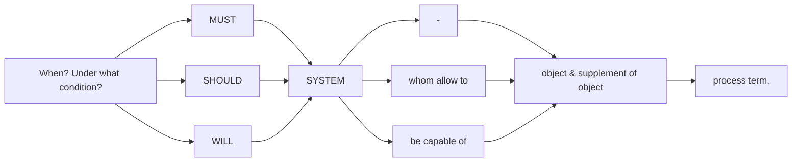

# SE2 - Requirements Engineering

## Requirements engineering

<h3>Schematic Req Eng Procedure</h3>

* Requirements engineering can be defined as the process of drawing out the services that the customer requires from a system and the constraints under which it operates and is developed.
* Requiremenets are descriptions of the system services and constraints that are generated during the requirement engineering process.

  
Inception

  <ul>
    <li> basic problem understanding.
    <li> identify stakeholders.
    <li> establish trustful communication & collaboration between customer & client.
  </ul>

  
Negotiation

  <ul>
    <li> Determine each stakeholder's win conditions. negotiate win-win 
  </ul>

Elaboration

  <ul>
    <li> Create analysis model that identifies data, functional and behavioral requirements.
  </ul>

Requirements management

  <ul>
    <li> Specification write-up.
    <li> Validation.
    <li> Document versioning.
  </ul>

<h3>Types of requirements :</h3>

1. <b>User requirements:</b>
    * Statements in natural language + diagrams of the system's services and its operational constraints.
    * Written for customers, must use their language and mental models.
    * defined using natural language, tables and diagrams.   UML  is your friend.
2. <b>System requirements:</b>
    * A structured document setting out detailed descriptions of the system's   functions, services and operational constraints.
    * Defines what should be implemented so may be part of a contract between client and contractor.
    * Must be concise in their technical effects.

<h3>Specification techniques :</h3>

<table style="width:100%">
  <tr>
    <th>Technique</th>
    <th>Pros</th>
    <th>Cons</th>
  </tr>
  <tr>
    <td>Natural Language</td>
    <td> - </td>
    <td>Ambiguous. Over-flexible. Lack of modularisation</td>
  </tr>
  <tr>
    <td>Structured Language Specifications</td>
    <td>standard templates, expressiveness & uniformity</td>
    <td>limited terminology</td>
  </tr>
  <tr>
    <td>Tabular Specifications</td>
    <td>Predefined items</td>
    <td>guidance for completeness</td>
  </tr>
  <tr>
    <td>Description Languages</td>
    <td>Concise</td>
    <td>Unsuitable for customers; real life situations generally hard to deal with.</td>
  </tr>
  <tr>
    <td>Graphical Models</td>
    <td>Structured and Concise</td>
    <td>-</td>
  </tr>
</table>

<h4>Requirements hierarchy</h4>

<table style="width:100">
<tr>
  <td> - </td>
  <th>Client Managers</th>
  <th>System End-Users</th>
  <th>Client Engineers</th>
  <th>Contract Managers</th>
  <th>System Architects</th>
  <th>Software Developers</th>
</tr>
<tr>
  <td>User Requirements</td>
  <td> x </td>
  <td> x </td>
  <td> x </td>
  <td> x </td>
  <td> x </td>
  <td> - </td>
</tr>
<tr>
  <td>System Requirements</td>
  <td> - </td>
  <td> x </td>
  <td> x </td>
  <td> - </td>
  <td> x </td>
  <td> x </td>
</tr>
<tr>
  <td>Software Design Sepecifications</td>
  <td> - </td>
  <td> - </td>
  <td> x </td>
  <td> - </td>
  <td> x </td>
  <td> x </td>
</tr>
</table>

<h3>Users of the requirements document</h3>

<table style="width:100%">
  <tr>
    <th>Users</th>
    <th>Details</th>
  </tr>
  <tr>
    <td>System Customers</td>
    <td>Specify the requirements and read them to check that they meet their needs. They specify changes to the requirements.</td>
  </tr>
  <tr>
    <td>Managers</td>
    <td>Use the requirements document to plan a bid for the system and to plan the system development process.</td>
  </tr>
  <tr>
    <td>System Engineers</td>
    <td>Use the requirements to understand what system is to be developed.</td>
  </tr>
  <tr>
    <td>System test engineers</td>
    <td>Use the requirements to develop validation tests for the system.</td>
  </tr>
  <tr>
    <td>System maintenance engineers</td>
    <td>Use the requirements to help understand the system and the relationships between its parts.</td>
  </tr>
</table>

<h3>Functional & Non-Functional Requirements</h3>

1. Functional requirements:
    * Statements of services the system should provide.
    * How the system should reach to particular inputs.
    * How the system should behave in particular situations.
    * Examples :
      * Users shall be able to search either all of the initial set of databases or select a subset from it.
      * The system shall provide appropriate viewers for the user to read documents in the document store.
      * Every order shall be allocated a unique identifier (ORDER_ID) which the user shall be able to copy to the account's permanent storage area.
2. Non-functional requirements:
    * Constraints offered by the system such as timing constraints.
      * Properties : reliability, response time and storage requirements.
      * Constraints: I/O Device capability, system representations, ...
    * Constraints on the development process, standards, etc.
    * Non-functional requirements may be more critical than functional requirements.
    * <b>Examples :</b>
      * <b>External Requirement</b> : The system shall not disclose any personal information about customers apart from their name and reference.
      * <b>Organisational Requirement</b>
3. Domain requirements:
    * Requirements that come from the application domain of the system and that reflect characteristics of that domain.

<h3>Requirements Imprecision</h3>

1. Problems when requirements not precisely stated.
2. Ambiguous requirements may be interpreted in different ways by developers and users.

<h3>Goals & Requirements</h3>

* Non-functional requirements are very difficult to state precisely, imprecise requirements may be difficult to verify; therefore, we can use goals.

* A goal can be a general user intention such as ease of use.

  * Verifiable non-functional requirement or a statement using some measure that can be objectively tested.
  * Use-case scenarioss, augmented with measurable effect!
  * Goals help developers illustrate the users intentions.
  * <b>Example :</b>
    * <b>System goal :</b> The system should be easy to use by experienced controllers and should be organised in such a way that user errors are minimised.
    * <b>Verifiable non-functional requirement:</b>
      * Experienced controllers shall be able to use all the system functions after a total of two hours training.
      * After this training, the average number of errors made by experienced users shall not exceed two per day, logged over one week.

