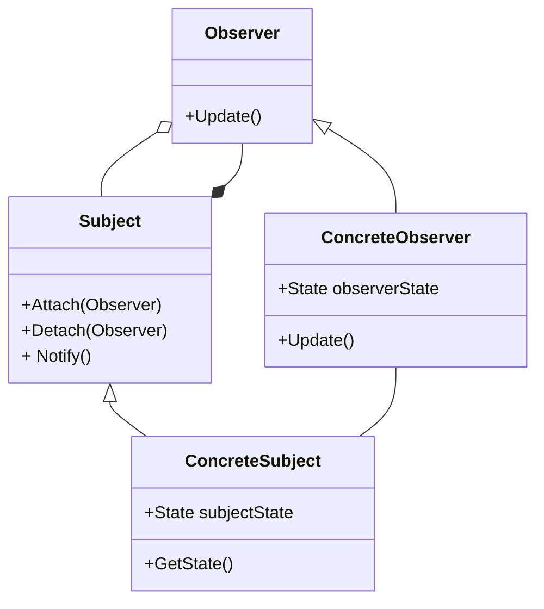
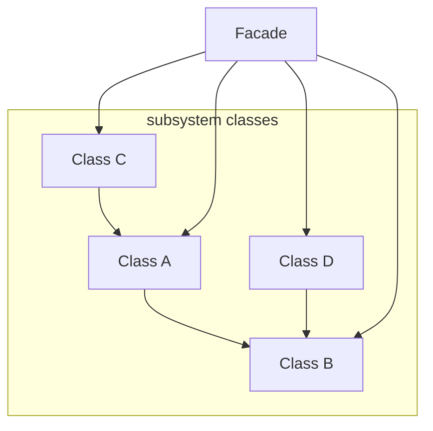

# SE4 - Design Patterns

<h3>Introduction</h3>

Be a good programmer and an efficient one, meaning take the chance to learn from others. 
Similar patterns occur over and over so do not reinvent the wheel and share knowledge of problem solving. Facilitate communication between programmers, and write elegant and graceful code. 

<h3>Design Patterns</h3>

A pattern is a description of the problem and the essence of its solution, it should be sufficiently abstract to be reused in different settings and often rely on object characteristics such as inheritance and polymorphism. 

A design pattern is a way of re-using abstract knowledge  about a (sw) design problem and its solution.

<h3>Pattern Elements</h3>

* Name
  * A meaningful pattern identifier
* Description
  * A description of the pattern
* Problem / Applicability description
* Solution Description
  * Not concrete design but template for design solution that can be instantiated in different ways.
* Consequences
  * The results and trade-offs of applying the pattern.

<h4>Example :</h4>

* Name: Singleton
* Description: Ensure a class has only one instance and provide a global point of access to it.
* Problem/Applicability: used when only one object of a kind may exist in the system.
* Solution:
  * defines an instance operation that lets clients access its unique instance. 
  * Instance is a class operation
  * Responsible for creating and maintaining its own unique instance.

<h3>The Observer Pattern</h3>

The observer pattern is a software design pattern in which an object, called the subject, maintains a list of its dependents, called observers, and notifies them automatically of any state changes, usually by calling one of their methods.

* Name: Observer
* Description:
  * Seperates the display of object state from the object itself.
* Problem/Applicability:
  * Used when multiple displays of state are needed.
* Solution:
  * See slide with UML description.
* Consequences:
  * Optimizations to enhance display performancec are impractical.

<h3>The Mediator Pattern</h3>

In software engineering, the mediator pattern defines an object that encapsulates how a set of objects interact. This pattern is considered to be a behavioral pattern due to the way it can alter the program's running behavior.

* Name: Mediator
* Description
  * Define an object that encapsulates how a set of objects interact. Mediator promotes loose coupling by keeping objects from referring to each other explicitly.
* Problem/Applicability
  * Complex interaction exists.
* Consequences
  * Limits subclassing
  * Decouples colleagues
  * Simplifies object protocols
  * Abstracts how objects cooperate
  * Centralizes control

<h3>The Façade Pattern</h3>

The facade pattern (also spelled façade) is a software-design pattern commonly used in object-oriented programming. Analogous to a facade in architecture, a facade is an object that serves as a front-facing interface masking more complex underlying or structural code.

* Description: 
  * Provides a  unified interface to a set of interfaces in a subsytem  or defines a higher-level interface that makes subsystem easier to use.
* Applicability
  * Need to provide a simple interface to a complex system.
  * Need to decouple a subsystem from its clients.
  * Need to provide an interface to a software layer.
* Consequences
  * Shields clients from subsystem componenets
  * Promotes weak coupling between the subsystem and its clients.

<h3>The Proxy Pattern</h3>

In computer programming, the proxy pattern is a software design pattern. A proxy, in its most general form, is a class functioning as an interface to something else. The proxy could interface to anything: a network connection, a large object in memory, a file, or some other resource that is expensive or impossible to duplicate. In short, a proxy is a wrapper or agent object that is being called by the client to access the real serving object behind the scenes.

* Description:
  * Provide a surrogate or placeholder for another object to control access to it.
* Problem/Applicability
  * Remote proxies can hide the fact that a real object is in another address space .
  * Virtual proxies can create expensive objects on demand.
  * Protection proxies can control access to an object.
  * Smart references can perform additional action above a simple pointer.

<h3>The Adapter Pattern</h3>

In software engineering, the adapter pattern is a software design pattern (also known as wrapper, an alternative naming shared with the decorator pattern) that allows the interface of an existing class to be used as another interface.[1] It is often used to make existing classes work with others without modifying their source code.

* Description:
  * Adapter lets classes work together that could not otherwise because of incompatible interfaces.
* Problem/Applicability
  * Need to use an existing class whose interface does not match .
  * Need to make use of incompatible classes.
* Consequences:
  * Class adapter commits to the concrete Adapter class.

<h3>The Composite Pattern</h3>

In software engineering, the composite pattern is a partitioning design pattern. The composite pattern describes a group of objects that are treated the same way as a single instance of the same type of object. The intent of a composite is to "compose" objects into tree structures to represent part-whole hierarchies.

* Definition:
  * Compose objects into tree structures to represent part-whole hierarchies .
  * Composite lets clients treat individual objects and compositions of objects uniformly.
* Problem/Applicability:
  * Any time there is partial overlap in the capabilities of objects.

<h3>Types of Patterns</h3>

* Creational:
  * Singleton: A class of which only a single instance can exist.
* Structural Patterns:
  * Façade : A single class that represents an entire subsystem
  * Proxy : An object representing another object
  * Composite : A tree structure of simple and composite objects
  * Adapter : Match interfaces of different classes.
* Behavioral Patterns:
  * Mediator: Defines simplified communication between classes.
  * Observer: A way of notifying change to a number of classes.

<h3>Summary:</h3>

* Design patterns are generic, reusable design templates for OOP to be adapted by the programmer for faster and safer implementation.

* Three main types of patterns :  creational, structural and behavioral .

