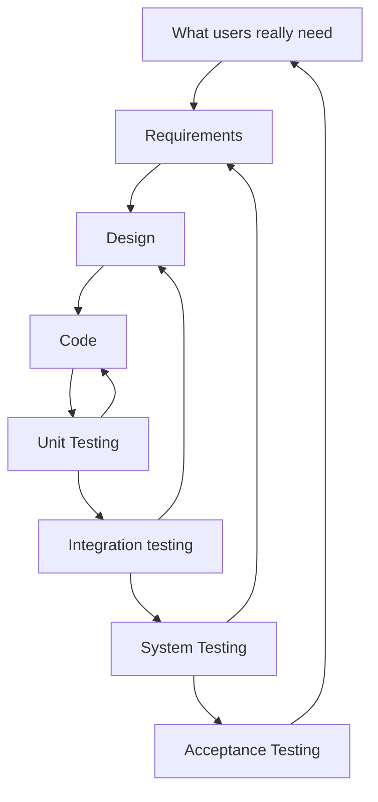
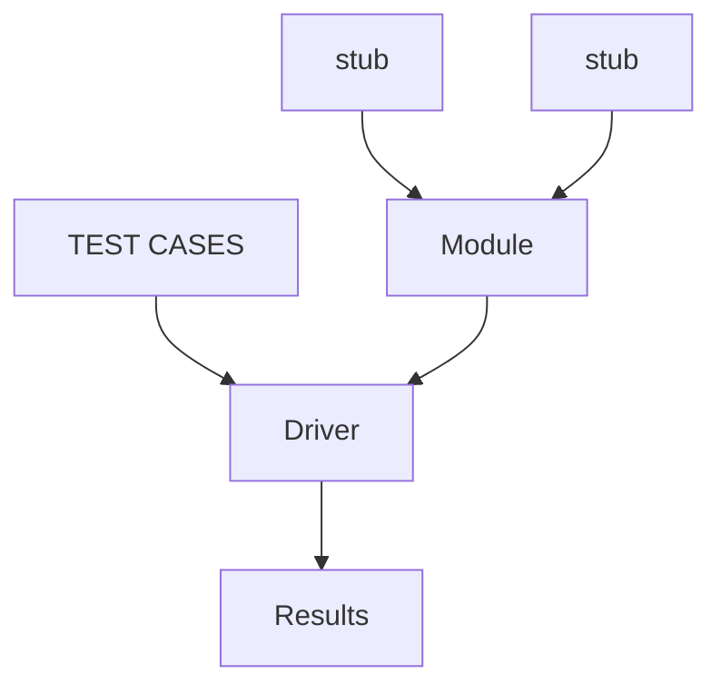
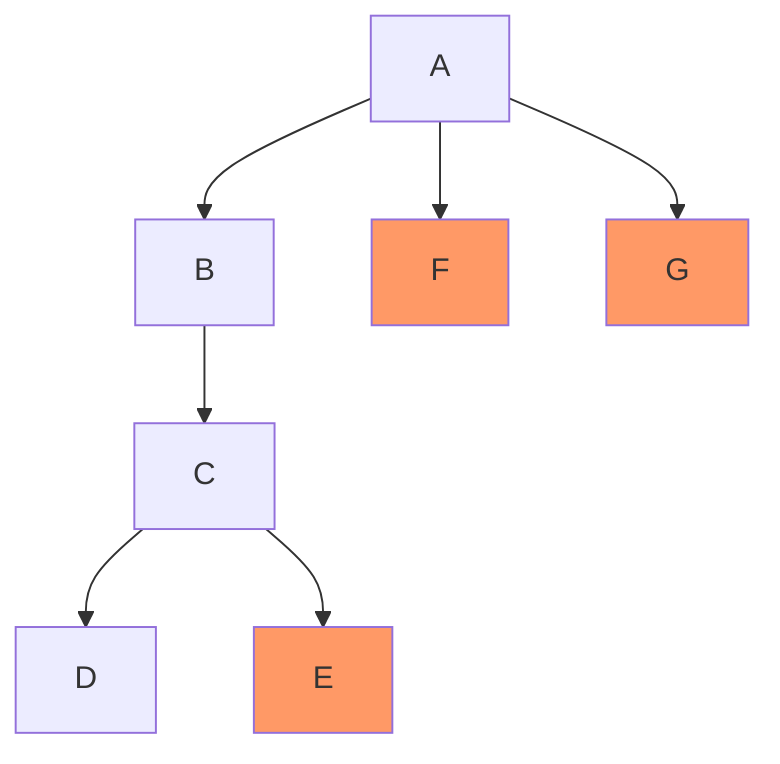
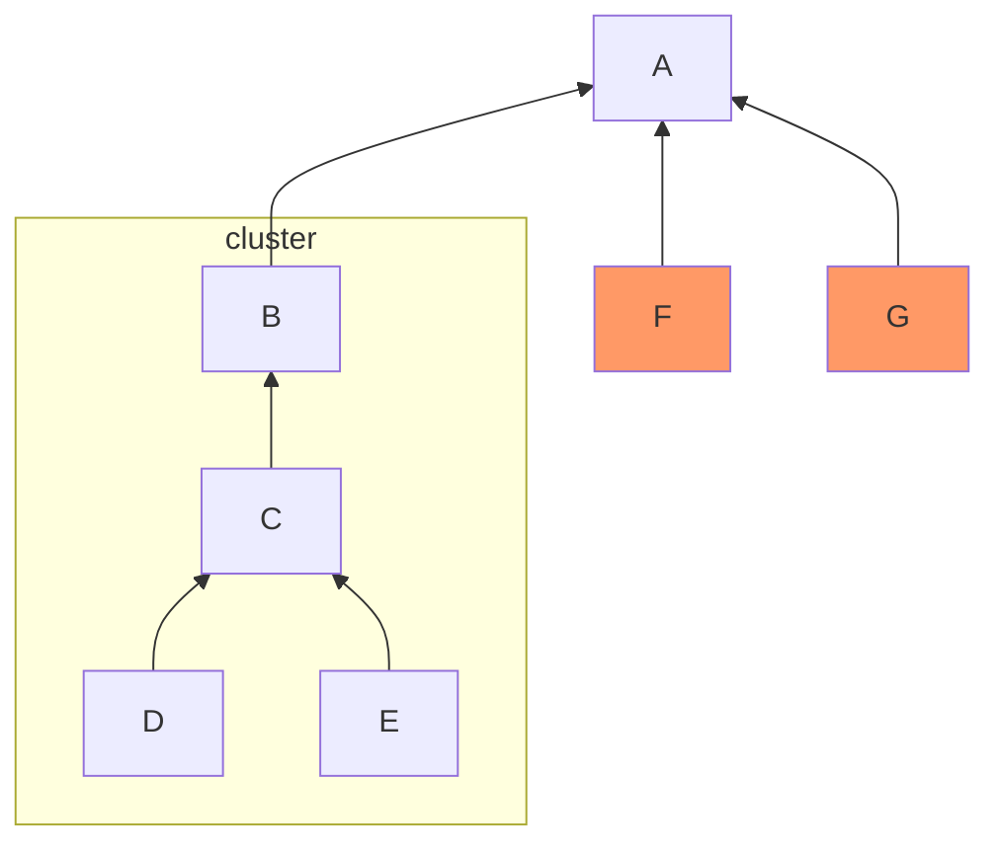
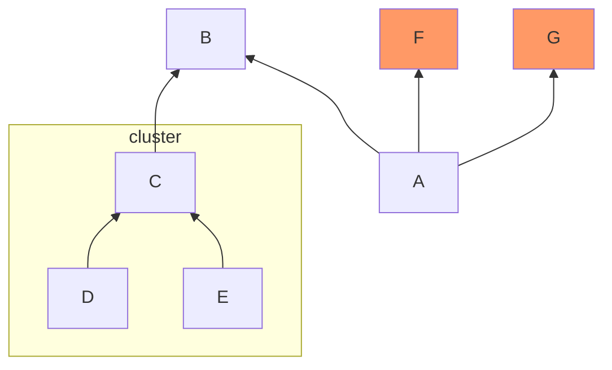
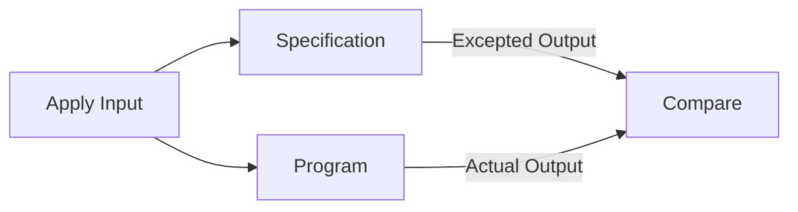
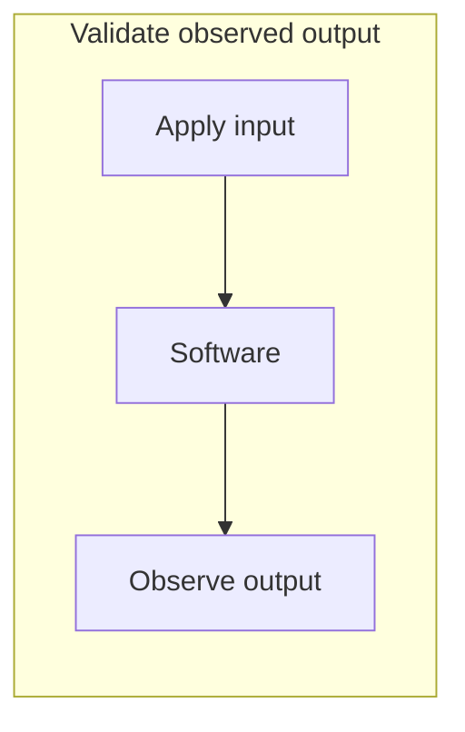
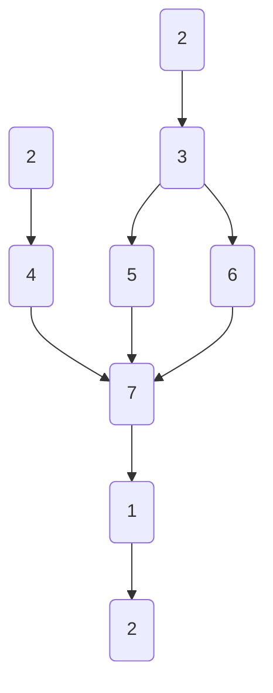

# SE6 - Testing

## Software Testing

* Software testing is the process of exercising a program with the specific intent of finding errors prior to deliver to the end user. It shows errors, requirements conformance, performance and is an overall indication of <b>quality</b>.

<h3>Testing & The Design Cycle</h3>

<h3>Unit Testing</h3>

* Test unit is a code that tests a specific target, usually one or more test module/class. In object oriented programming the target is frequently one class.
* Test case is the test of an assertion ("design promise") or particular feature i.e. writing to then deleting an item from an empty stack yields an empty stack.

<h4>Unit Test Environment</h4>

* Test driver is a dummy test environment for test class.
* Test stub are dummy methods of classes used but not available. 

<h3>Equivalence Class Testing</h3>

* Equivalence class testing poses the issue that we can practically never do an exhaustive testing on input combinations; therefore, we build equivalence classes of test input situations and test one candidate per class.

<h3>Integration Testing</h3>

* Integration testing is to test interactions among units :
  * import/export type compatibility
  * range errors
  * representation
  * Example:
    * F1 calls F2(elapsed_time) -- F1 thinks in seconds but F2 thinks in miliseconds.

<h4>Top-Down Integration</h4>

Top-Down integration means that the top module is tested with stubs;however, we replace these stubs one at a time in a "depth first" approach and as new modules are integrated some subset of tests are re-run. 

<h4>Bottom-Up Integration</h4>

Bottom up integration mean we start from the bottom and build our way up towards other modules. Worker modules are grouped into builds(clusters) and integrated. Drivers are then replaced one at a time.

<h4>Sandwich Testing</h4>

Sandwich testing top modules are tested with stubs; while worker modules are grouped into builds and integrated.

<h3>System Testing</h3>

* System testing is to determine whether systems meets requirements and that the hardware and software were properly integrated. System testing focuses on use & interaction of system functionalities rather than details of implementation. System testing should be carried out by a group independent of the code developers. We can distinguish two types of testing :
  * Alpha testing: end users at developer's site
  * Beta testing: at end user site, w/o developer

<h3>Acceptance Testing</h3>

This is the last phase a testing where the goal is to get the approval from customer. It should be very well structured and must be sure that the demo works. Customer may be tempted to demand more functionality when getting exposed to new system;however, you should ideally get test cases which were already agreed on during analysis phase. 

<h3>Testing Methods</h3>

1. <b> Static </b> testing:
    * Collects information about a software without executing it.
2. <b> Dynamic </b> testing:
    * Collects information about a software with executing it.
    * Makes sure the software behaves properly.
    * In both development and target environments?
3. <b> Regression </b> testing

<h4>1. Static Analysis</h4>

* Control flow analysis and data flow analysis:
  * Provide extensive data, eg, for code reviews, project management, end of project statistics.
* Examples of errors that can be found.
  * Unreachable statements
  * Variables used before initialization 
  * Variables declared but never used
  * Possible array bound violations.

<h4>2. Formal Verification</h4>

* Given a model of a program and a property, determine whether model satisfies property, based on mathematics.
  * If the light for east-west is green, then the light for south-north should be red. 

<h4>3. Black-Box = Spec-Based Testing</h4>

* No knowledge about code internals, relying only on interface spec.

* Limitations:
  * Specifications are not available
  * Many companies still have code only and no other document.

<h4>4. White-Box</h4>

* Check that all statements & conditions have been executed at least once.
* Look inside modules/classes.

* Limitations:
  * Cannot catch omission errors -- missing requirements?
  * Cannot provide test oracles -- expected output for an input?

<h3>Coverage Analysis</h3>

* Coverage analysis measuring how much of the code has been exercised by identifying unexecuted code structures, removing dead unwanted code and adding more test cases.

* Metrics include:
  * Entry points
  * Statements
  * Conditions

### Coverage Analytics: Metrics

* Cyclomatic complexity of flow graph V(G) = number of simple decisions + 1

<h3>Path Testing</h3>

* derive indenpendent paths: V(G) = 4 $\rightarrow$ four paths. Derive test cases to exercice these paths.

<h3>Equivalence Classes</h3>

* The issue present is that we can practically never do an exhaustive testing on input combinations.

* The idea is to build equivalence classes of test input situations and test one canditate per class.

<h3>Terminology Cx</h3>

* C0 = every instruction
* C1 - every branch (even if there's no else!)
* C2, C3 = every condition once true, once false.
* C4 = path coverage: every possible path taken.

* Rule of thumb: 95% C0, 70% C1

<h3>Tech Inset: Memory Leaks</h3>

* Memory leak is when memory gets allocated but not released any more. It usually leads to reduced performance due to excessive resource usage and may cause memory overflow.

<h3>PLs Revisited</h3>

* Stack :
  * Automatic management (stack frame allocation/deallocation). The stack pointer marks limit of valid data on stack; compiler generates code to grow & shrink stack on function entry/return (generally: block level).
* Heap :
  * Explicit allocations and deallocaton (programmer driven) using `malloc()` \ `free` or `new` \ `delete` \ `delete`.

<h3>Preformance Profiler</h3>

* Code profiling is benchmarking execution to understand where time is being spent. It helps the programmer understand which lines of code are responsible for the bulk of execution time, how many times is the looping construct executed, and which approach to coding a block of logic is more efficient? Without profiling, answering this becomes a guessing game. 

* Technique:
  * Profiler runs while application runs
  * Records frequency & time

