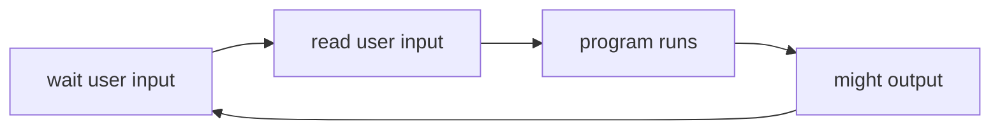
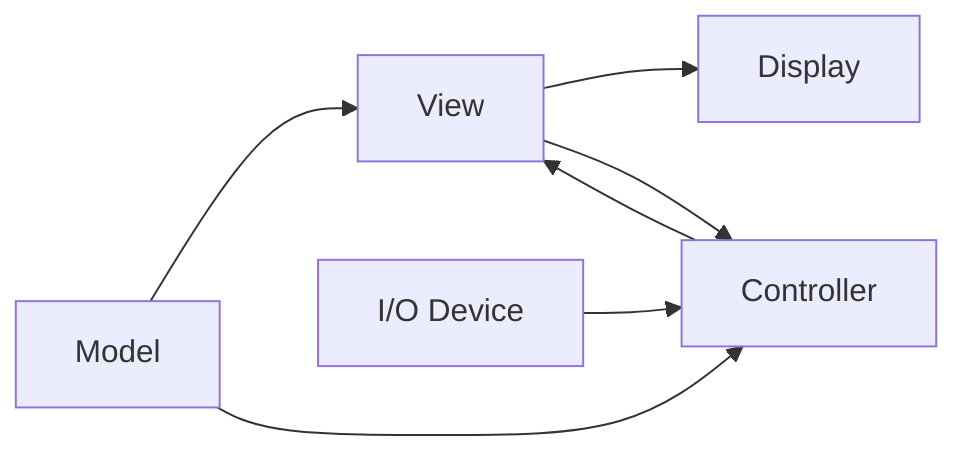

# SE7 - GUI Technologies

## Graphical User Interface Technology

<h3><font color="#BB86FC">Sequential Programs</font></h3>

Sequential modelsa are model where the program takes control, prompts for input then the user waits on the program, the program then tells user it's ready for more input, the user enters more input and so on.



The downside is that it's difficult to model the many actions a user can take.

<h3><font color="#BB86FC">Modern GUI Systems</font></h3>

* Three concepts:
  * <b><font color="yellow">Event-driven</font></b> programming
  * <b><font color="yellow">Widgets</font></b>
  * <b><font color="yellow">Interactor</font></b> tree


<h4><font color="#CF6679">Event-Driven Programming</font></h4>

* Instead of the user waiting on program, the program waits on the user. All communication from user to computer is done via "events". i.e. "mouse button went down", "item is being dragged"...

* All events generated go to a single event queue which is provided by operating system, ensures that events are handled in the order they occured, and hide specifics of input from apps.

<h4><font color="#CF6679">Widgets</font></h4>

* Widgets("Window Gadget") are reusable interactive object that handle certain events. Widgets say what events they are interested in, the event queue sends events to the right widget. Widgets then update appearance, and generate some new events (i.e. : button pressed, window closing, etc..) but these events are sent to interested listeners instead. 

<h4><font color="#CF6679">Interactor Tree</font></h4>

* Decompose interactive objects into a tree

```
Display Screen
├── "C:\Desktop" Window      
│   ├── title bar             
│   ├── horizontal scroll bar
│   ├── contents area
│   │   ├── "hello" folder
│   │   ├── "test" file
│   ├── ...                
│   └── ...
├── "Downloads" Window
└── ...     
```

<h3><font color="#BB86FC">Model View Controller</font></h3>

* Architechture for interactive apps, introduced by smalltalk developers
* Partitions application in a way that is scalable and mainatinable.



<h4><font color="#CF6679">Model</font></h4>

* The model is the information the application is trying to manipulate and a representation of real world objects.

<h4><font color="#CF6679">View</font></h4>

* The view implements a visual representation of the model, can generalize to virtually any externally observable action: audio/speech, alarms,... Implements a visual display of the model. May also have multiple views (e.g., shape view and numerical view). Views must also be notified each time the model is changed so that it can change later.


<h4><font color="#CF6679">Controller</h4></font>

* The controller receives all input event from the user, decides what they mean and what to do. It communicates with view to determine which objects are being manipulated and then calls model methods to make changes on objects.


<h4><font color="#CF6679">View/Controller Relationship</font></h4>

* "Pattern of behavior in response to user events (controller issues) is independent of visual geometry (view issues)".
* Controller must contact view to interpret what user events mean.


<h4><font color="#CF6679">Combining View & Controller</font></h4>

* View and controller are tightly intertwined, lots of communication happens between the two.
* Always occur is pairs, i.e for each view we need a seperate controller.

<h4><font color="#CF6679">Why use MVC?</font></h4>

* Combining MVC into one class or using global variables will not scale because models may have more than one view, each is different and needs update when model changes.
* Seperation eases maintenance.

<h4><font color="#CF6679">Reflections</font></h4>

* MVC is a complex design pattern with many variations:

* Stanford HCI : Same as MVC but the model and controller can communicate back and forth.
* ModelDelegate : Same as MVC but the model and view can communicate back and forth.
