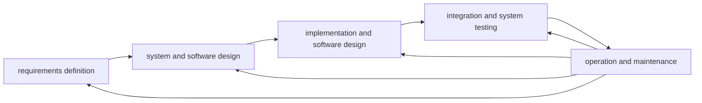
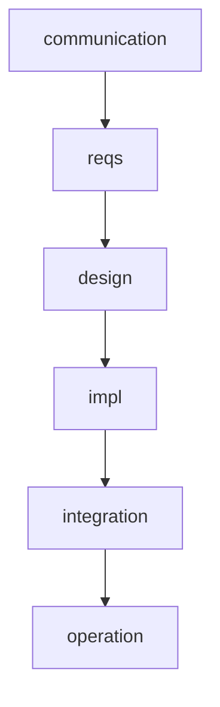
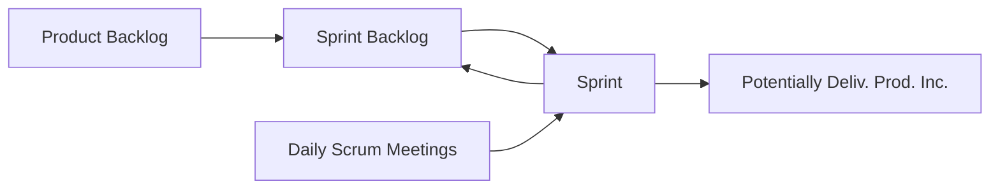

# SE8 - Software Process Models

## Software Process Models

<h3>Waterfall Model</h3>

* Partitioning into distinct stages
  * Difficult to accommodate change after process is underway
  * Inflexible

* Few business systems have stable requirements
  * Changing customer requirements
  * Increasing domain understanding
  * Unforeseen technical difficulties

* Only appropriate when requirements well-understood and fairly stable. 
* Mostly used for large systems engineering projects where system is developed at several sites.

<h3>The incremental model</h3>

`Increment 1`

We then deliver `increment 1` and proceed to start with the next one, in such a way that each process begins the next iteration as soon as its done with the previous and does not wait on the linear sequence to finish.

<h4>Incremental Delivery</h4>

* Development & delivery broken down into increments
  * each increment delivering part of the required functionality
* User requirements are prioritised
  * highest priority requirements included in early increments
* Once development of increment is started, requirements are frozen
  * requirements for later increments can continue to evolve.

<h4>Incremental Dev. Appraisal</h4>

* Customer value delivered with each increment
  * system functionality is available earlier
* Early increments act as a prototype
  * help elicit requiremenets for later increments
* Lower risk of overall project failure
* Highest priority system services tend to receive most testing

 
<h3>Agile/XP Methods & Scrum</h3>

<h4>Principles of Agile Methods:<h4>

These are grouped and called <b>CIPCS</b>

 <table style="width:100%">
  <tr>
    <th>Principle</th>
    <th>Description</th>
  </tr>
  <tr>
    <td>Customer Involvement</td>
    <td>Customer must be closely involved in order to provide and prioritise new system requirements + to evaluate iterations.</td>
  </tr>
  <tr>
    <td>Incremental Delivery</td>
    <td>Software is developed in increments such that the customer specifies requirements to be included per increment.</td>
  </tr>
  <tr>
    <td>People, not process</td>
    <td>Recognize and exploit the team skills and leave them to develop their own ways of working.</td>
  </tr>
  <tr>
    <td>Embrace Change</td>
    <td>Expect system requirements to change and design the system to accomodate these changes.</td>
  </tr>
  <tr>
    <td>Maintain Simplicity</td>
    <td>Focus on simplicity in both software and developement process and actively work on eliminating complexity wherever possible.</td>
  </tr>
</table>

<h4>Extreme Programming</h4>

* An 'extreme' variation of iterative developemeent based on very small increments :
  * New versions may be built several times per day;
  * Increments are delivered to customers every 2 weeks or so;
  * All tests must be run for every build; build only accepted if all tests run successfully.
* Relies on
  * Constant code improvement
  * User involvement in the development team
  * Pairwise programming
* Perhaps best-known & most widely used agile method

<h4>Pair Programming</h4>

* Programmers work in pairs, sitting together to develop code 
  * helps develop common ownership of code
  * spreads knowledge across the team
  * cross checking of all code
* Informal review process 
  * Each line of code looked at by more than 1 person
* Encourages refactoring
  * Whole team can benefit
* Measurements suggest that development productivity is similar to independent work.

<h4>XP and Change</h4>

* Conventional widsom: design for change
  * worth spending time & effort anticipating changes
  * reduces costs later in the life cycle
* XP, however, maintains that this is not worthwhile
  * cannot be reliably anticipated
* Rather, it proposes constant code improvement
  * make changes easier when they have to be implemented

```mermaid
graph TD
id1[select user stories for this release] --> id2[breakdown: stories -> tasks]
id2 --> id3[plan release]
id3 --> id4[develop / integrate / test]
id4 --> id5[release]
id5 --> id6[evaluate]
id6 --> id1
```

<h4>The XP Release Cycle</h4>

<h4>Consequences of Extreme Programming</h4>

* Incremental Planning
  * Stories determined by time available + relative priority
* Small releases
  * Minimal useful set of functionality that provides business value is developed first
* Collective ownership
  * Pairs of developers work on <b>all</b> areas of system.
  * no islands of expertise, all developers own all code.
  * <b>Anyone can change anything</b>
* Simple design
  * Enough design to meet current requirements and no more
* Simple code : Refactoring
* Sustainable pace
  * No large amounts of over-time which often reduced code quality and medium term productivity.
* On-site Customer
  * End-user representative <b> available full time </b>
  * <b> Customer member </b> of development team and is reponsible for bringing system requirements to the team.

<h4>Agile Methods : Appraisal</h4>

* Team members may be unsuited to the <b>intense involvement</b> of agile methods. 
* Developers need to be experienced, not too different in expertise.
* Can be difficult to keep intreset of customers involved in process.
* <b> Maintaining simplicity</b> requires extra work.
* Contracts may be a problem as prioritising changes can be difficult when there are multiple stakeholders as with other approaches to iterative development.
* Agile methods probably best suited to small/medium-sized business systems. <b>short-term, highly flexible projects</b>

<h3>Scrum</h3>

<h4>Scrum Componenets</h4>

* Scrum Roles :
  * Product Owner
    * Knows what needs to be built & in what sequence this should be done.
  * Scrum Master
    * Represents management to the project. Responsible for enacting scrum values and practices with a main goal to remove obstructions.
  * Scrum Team
    * Typically 5-6 full-time self-organizing cross-functional people (QA, Programmers, UI Designers, etc.).
    * Membership can only change between sprints.
* Scrum Process
  * Spring Planning Meeting
  * Kickoff Meeting
  * Sprint (~Iteration in a Unified Process)
  * Daily Scrum Meeting
  * Sprint Review Meeting
* Scrum Artifacts
  * Product Backlog
    * A list of requirements (features, bug fixes, non-funct. requirements) prioritized by the product owner to focus on customer value such that the feature sequence is the same as the delivery sequence.
    * Product backlog & business value items is a responsibility of Product Owner; however, the item size (estimated complexity/effort) determined by development team.
  * Spring Backlog
    * Items development team must deliver during next sprint.
  * Burndown Charts
    * Public displayed chart showing remaining work in sprint backlog.

<h4>Scrum Process : Details</h4>

<table width="100%">
<tr>
  <th>Process</th>
  <th>Description</th>
  <th>Participants</th>
  <th>Est. Duration</th>
  <th>Goal</th>
</tr>
<tr>
  <td>Kickoff Meeting</td>
  <td>Collaborative meeting at the beginning of the project</td>
  <td>Product Owner, Scrum Master</td>
  <td>8 hours; split to before lunch & after lunch</td>
  <td>Create product backlog</td>
</tr>
<tr>
  <td>Planning Meeting</td>
  <td>Collaborative meeting at the beginning of the project</td>
  <td>Product Owner, Scrum Master, Scrum Team</td>
  <td>8 hours; split to before lunch & after lunch</td>
  <td>Create sprint backlog</td>
</tr>
<tr>
  <td>Sprint</td>
  <td>An iteration during which product functionality is incremented (4 weeks, 3 weeks, 2 weeks, etc..) with no outside influence on scrum team.</td>
  <td>Scrum Team</td>
  <td>4 weeks; 3 weeks; 2 weeks; ...</td>
  <td>Implement and increase product functionality</td>
</tr>
<tr>
  <td>Daily Scrum Meeting</td>
  <td>short meeting held every day before Team starts working, such that every team memeber discusses what they did before, what issues they have and what they're doing next.</td>
  <td>Scrum Master, Scrum Team</td>
  <td>15 mins</td>
  <td>Keeps everyone update and create transparency in the team.</td>
</tr>
</table>

<h4>Scrum: Appraisal</h4>

<table width="100%">
<tr>
  <th>Advantages</th>
  <th>Drawbacks</th>
</tr>
<tr>
  <td>Completely developed and tested features in short iterations</td>
  <td>Undisciplined hacking (no written documentation)</td>
</tr>
<tr>
  <td>Simplicity of process</td>
  <td>Violation of responsibility</td>
</tr>
<tr>
  <td>Clearly defined rules</td>
  <td>-</td>
</tr>
<tr>
  <td>Increasing productivity</td>
  <td>-</td>
</tr>
<tr>
  <td>Self-organizing</td>
  <td>-</td>
</tr>
<tr>
  <td>Team members carry responsibilty</td>
  <td>-</td>
</tr>
<tr>
  <td>Improved communication</td>
  <td>-</td>
</tr>
<tr>
  <td>Combination with XP</td>
  <td>-</td>
</tr>
</table>

